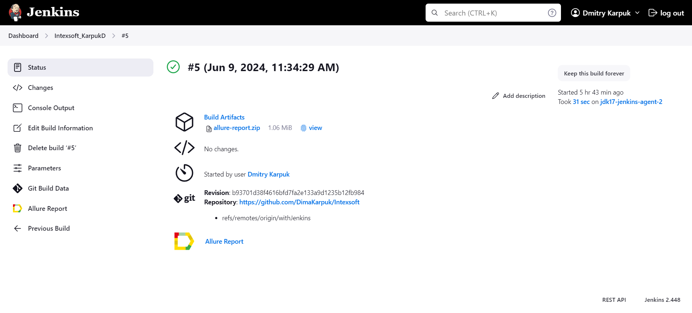

# Проект по автоматизации тестирования для компании [**intexsoft**](https://www.intexsoft.by/)


## **Содержание:**
____

* <a href="#tools">Технологии и инструменты</a>

* <a href="#cases">Примеры автоматизированных тест-кейсов</a>

* <a href="#jenkins">Сборка в Jenkins</a>

* <a href="#console">Запуск из терминала</a>

* <a href="#allure">Allure отчет</a>

* <a href="#telegram">Уведомление в Telegram при помощи бота</a>

* <a href="#video">Примеры видео выполнения тестов на Selenoid</a>
____

<a id="tools"></a>
### Технологии и инструменты:

<p align="left">
<a href="https://allurereport.org/"></a>
<a href="https://gradle.org/"></a>
<a href="https://www.jetbrains.com/idea/"></a>
<a href="https://www.java.com/"></a>
<a href="https://www.jenkins.io/"></a>
<a href="https://junit.org/junit5/"></a>
<a href="https://selenide.org/"></a>
<a href="https://aerokube.com/selenoid/"></a>
</p>

<a id="cases"></a>
## <a name="Примеры автоматизированных тест-кейсов">**Примеры автоматизированных тест-кейсов:**</a>
____
- ✓ *Параметризованный тест кликабельности категории на главной странице*
- ✓ *Пойск вакансии в городе Гродно на позицию AQA*
- ✓ *Заполнение резюме intexsoft*

____
<a id="jenkins"></a>
## </a><a name="Сборка"></a>Сборка в [Jenkins](https://jenkins.autotests.cloud/job/Intexsoft_KarpukD/)</a>
____
<p align="center">  
<a href="https://jenkins.autotests.cloud/job/Intexsoft_KarpukD/"></a>  
</p>


### **Параметры сборки в Jenkins:**

- *BROWSER (браузер, по умолчанию chrome)*
- *BROWSER_VERSION (версия браузера, по умолчанию 122.0)*
- *BROWSER_SIZE (размер окна браузера, по умолчанию 1928x1080)*
- *SELENOID_URL (логин, пароль и адрес удаленного сервера Selenoid)*

<a id="console"></a>
## Команды для запуска из терминала
___
***Локальный запуск:***
```bash  
gradle clean
gradle parameterized_test
gradle jobSearch_test
gradle resume_test
```

___
<a id="allure"></a>
## </a> <a name="Allure"></a>Allure [отчет](https://jenkins.autotests.cloud/job/011-mmuradov-JenkinsExercise-on-example-ZentistsTest/8/allure/)</a>
___

